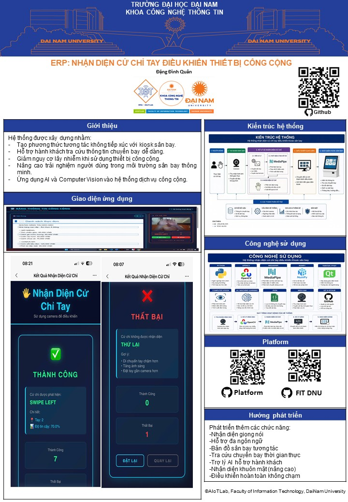

# NHẬN DIỆN CỬ CHỈ TAY ĐIỀU KHIỂN THIẾT BỊ CÔNG CỘNG


## 📋 Mô tả dự án

Đây là một hệ thống bảng thông tin điều khiển hoàn toàn bằng cử chỉ tay, không cần chạm vào màn hình. Sử dụng công nghệ MediaPipe để nhận diện tay và các cử chỉ được định nghĩa sẵn.

### 🎯 Ứng dụng thực tế
- ✈️ **Sân bay**: Hướng dẫn đường bay, thông tin gate, giờ khởi hành
- 🏬 **Trung tâm thương mại**: Bản đồ, danh sách cửa hàng, khuyến mãi
- 🏥 **Bệnh viện**: Thông tin khoa phòng, lịch khám, hướng dẫn
- 🎓 **Trường học**: Thời khóa biểu, thông báo, lịch sự kiện
- 🚌 **Nhà ga, bến xe**: Giá vé, lịch trình, thông tin tuyến
- 🎬 **Rạp chiếu phim**: Suất chiếu, giá vé, đặt vé
- 🏛️ **Bảo tàng**: Thông tin triển lãm, lịch sử tác phẩm

---

## 🎮 Các cử chỉ được hỗ trợ

| Cử chỉ | Tác dụng | Mô tả |
|--------|---------|-------|
| **Vuốt sang TRÁI** | Chuyển trang tiếp theo | Di chuyển tay từ phải sang trái |
| **Vuốt sang PHẢI** | Chuyển trang trước | Di chuyển tay từ trái sang phải |
| **Cuộn LÊN** | Cuộn nội dung lên | Di chuyển tay từ dưới lên trên |
| **Cuộn XUỐNG** | Cuộn nội dung xuống | Di chuyển tay từ trên xuống dưới |
| **ZOOM IN** | Phóng to | Đưa hai tay lại gần nhau |
| **ZOOM OUT** | Thu nhỏ | Tách hai tay ra xa |
| **NẮM TAY (GRAB)** | Tạm dừng/Lựa chọn | Gập tất cả các ngón tay |

---

## 📁 Cấu trúc thư mục

```
Thành phố thông minh/
├── main.py                 # File chính, chạy ứng dụng
├── gesture.py             # Module nhận diện cử chỉ
├── gui.py                 # Module giao diện hiển thị
├── config.py              # Module quản lý cấu hình
├── data_manager.py        # Module quản lý dữ liệu nội dung
├── config.yaml            # File cấu hình mẫu
├── requirements.txt       # Danh sách thư viện cần cài
├── README.md             # File này
├── data/
│   └── pages.json        # Dữ liệu nội dung (tự động tạo)
└── assets/               # Thư mục ảnh/file đính kèm
```

---

## 🔧 Cài đặt & Chạy

### 1. Cài đặt Python (yêu cầu Python 3.8+)
```bash
# Kiểm tra phiên bản Python
python --version
```

### 2. Cài đặt thư viện cần thiết
```bash
pip install -r requirements.txt
```

### 3. Tạo dữ liệu mẫu
```bash
python -c "from data_manager import DataManager; dm = DataManager(); dm.create_sample_data()"
```

### 4. Chạy ứng dụng
```bash
python main.py
```

**Hoặc với cấu hình tùy chỉnh:**
```bash
python main.py --config config.yaml --camera 0
```

---

## ⌨️ Phím tắt trong ứng dụng

| Phím | Chức năng |
|------|----------|
| **D** | Bật/Tắt chế độ Debug |
| **P** | Tạm dừng/Tiếp tục |
| **R** | Reset view (zoom = 1x, scroll = 0) |
| **N** | Chuyển trang tiếp theo |
| **B** | Chuyển trang trước |
| **Q** hoặc **ESC** | Thoát chương trình |


```
```


## 📊 Module & Chức năng

### gesture.py - Nhận diện cử chỉ
- **GestureType**: Enum các loại cử chỉ
- **GestureFrame**: Chứa dữ liệu khung hình + cử chỉ
- **GestureRecognizer**: Xử lý video stream và nhận diện cử chỉ
  - `process_frame()`: Xử lý một khung hình
  - `detect_swipe()`: Phát hiện vuốt
  - `detect_zoom()`: Phát hiện zoom
  - `is_fist()`: Kiểm tra nắm tay

### gui.py - Giao diện hiển thị
- **ContentType**: Loại nội dung (TEXT, IMAGE, MIXED)
- **Page**: Lưu trữ một trang nội dung
- **DisplayGUI**: Render giao diện bảng thông tin
  - `next_page()`: Trang tiếp theo
  - `previous_page()`: Trang trước
  - `zoom_in()` / `zoom_out()`: Phóng to/thu nhỏ
  - `scroll_up()` / `scroll_down()`: Cuộn nội dung
  - `render()`: Render khung hình

### config.py - Quản lý cấu hình
- **Config**: Dataclass chứa tất cả cấu hình
  - `load()`: Tải từ file YAML/JSON
  - `save()`: Lưu vào file

### data_manager.py - Quản lý dữ liệu
- **DataManager**: Quản lý nội dung trang
  - `load_pages()`: Tải từ file JSON
  - `save_pages()`: Lưu vào file JSON
  - `create_sample_data()`: Tạo dữ liệu mẫu

### main.py - Ứng dụng chính
- **GestureControlledDisplay**: Lớp chính, tích hợp tất cả
  - `run()`: Vòng lặp chính
  - `handle_gesture()`: Xử lý cử chỉ
  - `process_keyboard()`: Xử lý bàn phím

---

### Nhận diện cử chỉ không chính xác
1. Tăng `min_detection_confidence` trong `config.yaml` (0.5 → 0.7)
2. Đảm bảo ánh sáng đủ
3. Giảm `swipe_threshold` để nhạy hơn

### Hiệu suất chậm
1. Giảm độ phân giải camera: `camera_width: 320`, `camera_height: 240`
2. Tăng `min_tracking_confidence` lên 0.7-0.8
3. Giảm FPS: `camera_fps: 15`

---

## 📈 Thống kê & Logging

Chương trình tự động ghi lại:
- Tổng số khung hình xử lý
- Số lần nhận diện từng loại cử chỉ
- Thời gian chạy

In ra console khi thoát ứng dụng.

---

## 📚 Thư viện sử dụng

| Thư viện | Phiên bản | Mục đích |
|---------|----------|---------|
| OpenCV | 4.8.1 | Xử lý video/ảnh |
| MediaPipe | 0.10.9 | Nhận diện tay/gesture |
| NumPy | 1.24.3 | Tính toán số học |
| PyYAML | 6.0.1 | Đọc file cấu hình |

---

## 🎓 Kiến thức cần có

- **Python**: Cơ bản về OOP, dataclass, enum
- **OpenCV**: Xử lý ảnh, vẽ hình học
- **MediaPipe**: Hand tracking, landmarks
- **YAML/JSON**: Định dạng dữ liệu

---

## 📄 License

Dự án này được tạo cho mục đích học tập.

---

## 👨‍💼 Tác giả

**Đặng Đình Quân** - Thành phố thông minh

---


**Thanks for watching! Good luck! 🚀**
